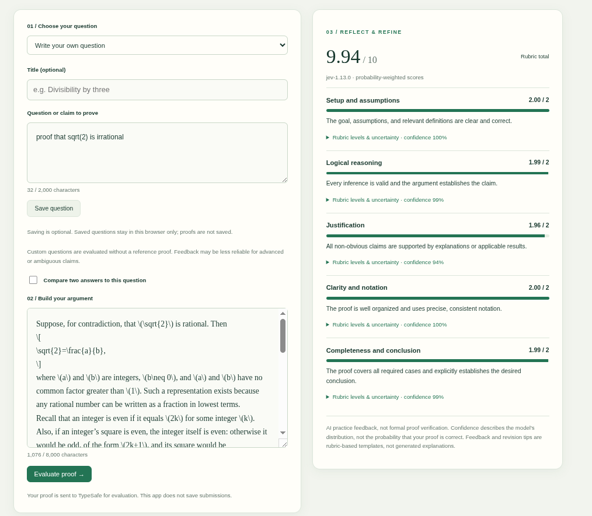

# Proof Practice

A self-contained Next.js + FastAPI app for elementary mathematical proofs, using Jev and your exact five-part rubric.

## Screenshot



Example study session with a custom question and proof feedback. The displayed
scores are AI judgments, not formal verification.

## Run locally

Requires Python 3.11+, [uv](https://docs.astral.sh/uv/), and Node.js 20.9+.

Terminal 1:

```sh
cd proof_practice/backend
cp .env.example .env
# Edit .env: set TYPESAFE_API_KEY from https://console.typesafe.ai/
uv sync --locked
uv run uvicorn app.main:app --reload --host 127.0.0.1 --port 8000
```

Terminal 2:

```sh
cd proof_practice/frontend
npm ci
npm run dev
```

Open http://localhost:3000. API documentation: http://127.0.0.1:8000/docs.
The question catalog works without a key; grading returns an explicit configuration error.
Optionally copy `frontend/.env.example` to `.env.local` to change the backend URL.
Next.js proxies `/api/*`, so browser requests stay same-origin and no CORS setup is required.
`BACKEND_URL` is used by rewrites at build time: set it before `npm run build` in production.

## Docker Compose

```sh
cd proof_practice
cp backend/.env.example backend/.env
# Edit backend/.env and set TYPESAFE_API_KEY.
docker compose up --build -d
```

Open http://localhost:3000. View logs with `docker compose logs -f`;
stop with `docker compose down`. If port 3000 is occupied, use
`FRONTEND_PORT=3001 docker compose up --build -d` and open port 3001 instead.
Docker Compose 2.24+ is required for the
optional environment file. Without `backend/.env`, the catalog works but grading
is unavailable. API keys are injected at runtime and excluded from image builds.

Both services run as non-root users and have health checks. Only Next.js is
published, bound to localhost; FastAPI is reachable internally as `backend:8000`.
The frontend's backend URL is baked into its build-time rewrites. Backend health
means the HTTP server is running, not that the Jev key or provider is working.
After changing credentials, run `docker compose up -d --force-recreate backend`.
Public deployment still needs the access and spending controls described below.

## Features

- Six questions: even sums, odd squares, consecutive products, contrapositive, induction, and sets.
- Write a custom question directly, or save it for reuse in this browser (localStorage).
- Saved questions can be removed or edited as a copy; they do not sync across devices.
- Custom claims are graded without a trusted reference proof; advanced/ambiguous claims may be less reliable.
- Optional hints, proof editor, input limits, loading/error states, and repeat evaluation.
- All five rubric Scores in **one asynchronous Jev request per answer**.
- Compare two answers to the same built-in or custom question: independent concurrent
  grading, side-by-side feedback, and B-minus-A differences for each dimension and total.
  Comparison costs two Jev requests; scores are not correctness verdicts.
- Original 0–2 fractional scores, probabilities per level, confidence, and an equally weighted total out of 10.
- Expandable rubric definitions and template revision checklists.

## PydanticAI architecture

`backend/app/grading.py` defines a reusable `Agent[GradingDeps, Evaluation]`, a typed
`RunContext` tool, and Pydantic-validated structured output. FastAPI injects the
shared async TypeSafe client; its lifespan closes network resources on shutdown.

Jev is a System One scoring model, **not an OpenAI-compatible chat model**. A
PydanticAI `FunctionModel` provides a bounded deterministic two-step workflow:
invoke `grade_with_jev` once, then forward its result to the structured output tool.
The adapter does not invent model responses or make grading judgments. Actual
semantic grading is performed exclusively by Jev through the official SDK.
This is intentionally not an autonomous LLM planner and requires no second model key.

The exact supplied rubric lives in `backend/app/rubric.json`. Trusted reference
proofs provide context, but valid alternative proof methods are explicitly allowed.
Student text is labeled untrusted data. This mitigates but does not guarantee
resistance to prompt injection.

The total is `sum(five scores)`, maximum 10. Each Score is the expected rubric level,
not the probability of proof correctness. High clarity cannot certify valid logic,
and neither the total nor confidence is used to issue a correctness verdict.
Feedback uses the most probable rubric level (not rounding the expected score);
revision tips are static templates. Jev does not generate prose explanations.

## Formal verification scope

This app currently evaluates prose using Jev. It does not run Lean, translate
proofs into Lean, generate questions with an LLM, or certify proof correctness.

A future formal-verification feature could add curated Lean theorem statements,
a separate generative model to formalize the student's reasoning, and an isolated
Lean runner. Students would need to inspect the statement, assumptions, and any
steps the model added or repaired. A compiling formalization does not by itself
validate the original prose. Such a runner would need resource limits, no network
access, and restrictions against unfinished proofs (`sorry`), added axioms, and
other proof-checking bypasses. These are design notes, not implemented guarantees.

## Checks

```sh
cd proof_practice/backend
uv run pytest -q
uv run ruff check .
uv run ruff format --check .

cd ../frontend
npm run typecheck
npm run build
```

Tests mock only the external Jev client and exercise the real PydanticAI workflow,
API validation, full rubric batching, missing credentials, incomplete answers,
and safe provider errors. Live Jev accuracy is not validated by these mock tests.
Before relying on grades, evaluate representative correct, incomplete, circular,
and invalid proofs against human labels.

## Privacy and deployment scope

Credentials remain on the backend. Submitted proofs are sent to TypeSafe; this app
has no database, stored proof history, or proof-body logging. Questions you explicitly
save are kept in browser localStorage until removed or browser storage is cleared. Provider retention policies
still apply. Avoid SDK debug logging in production because it logs request bodies.

This is a local practice starter, not a hardened public grading service. Add
server-side authentication, per-user rate limits, request-body limits at the ingress,
spending controls, and HTTPS before exposing paid evaluation publicly. Do not rely
on same-origin proxying as access control. AI feedback is not formal proof verification.
